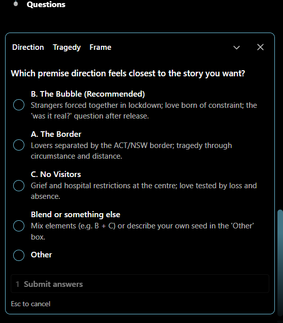
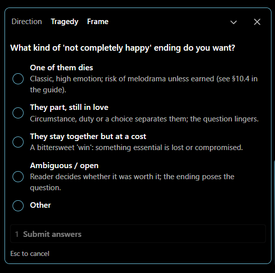
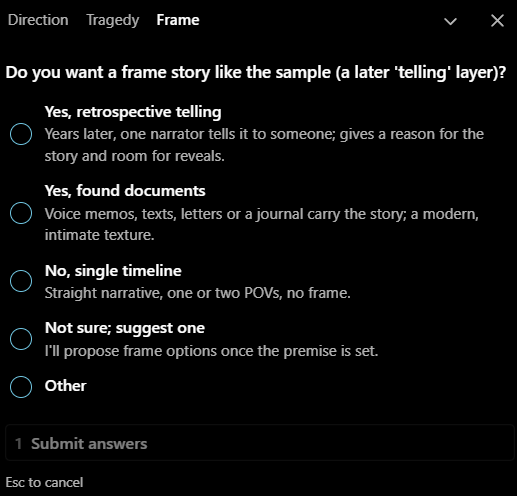

# Writing a Novel with Claude Code

A showcase of using [Claude Code](https://claude.com/claude-code) as a writing partner, from "analyse a published novel" to a finished, reviewed short story and a reusable skill for writing the next one.

Everything in this repository was produced in a single working session by eleven prompts. The prompts themselves are in [`prompts/sample-prompts.md`](prompts/sample-prompts.md), along with screenshots of Claude's interactive questions and summaries.

> **The story is called *Close Contact*.** It is about 8,000 words in five chapters. You can read it without any of the surrounding material. See [the story](#the-story) below, and read the chapters in [`chapters/`](chapters/).

---

## What this shows

Claude Code is usually pictured writing software. This repo uses it for something closer to editorial work: **analysing, planning, drafting, measuring, reviewing and packaging** a piece of fiction, with the human making the creative decisions along the way.

| Capability on show | Where to see it |
|---|---|
| **Close reading and analysis.** Reading a full novel and turning it into reusable craft guides, with short exemplars | [`writing-style.md`](writing-style.md), [`story-development.md`](story-development.md) |
| **Interactive brainstorming.** Short rounds of multiple-choice questions with a recommended default, each followed by a working draft of the premise | Prompt 2 and the screenshots in [`prompts/`](prompts/sample-prompts.md) |
| **Research and fact-checking.** Verifying real-world details (lockdown dates, rules, the Floriade festival) and tagging what is invented | [`premise.md`](premise.md) (sources and `[VERIFY]` tags) |
| **A story bible that keeps decisions.** Locked decisions, a hidden backstory timeline, character cards, a plant-and-payoff ledger | [`premise.md`](premise.md), [`characters.md`](characters.md) |
| **Iterative refinement with the human in charge.** Title options, form and length decided by the user, with every document updated to match | Prompts 4 to 6 |
| **Drafting to a brief.** Five chapters, each in its own file, written to a word budget and a style guide | [`chapters/`](chapters/) |
| **Measuring prose.** A script that reports sentence length, dialogue share, filler and repeated phrases, used to guide the polish pass | [`.claude/skills/romance-novel-writer/scripts/measure_prose.js`](.claude/skills/romance-novel-writer/scripts/measure_prose.js) |
| **Structured self-review.** A reusable quality checklist, a scored review, and a prioritised revision plan, including continuity errors found and fixed | [`checklist.md`](checklist.md) |
| **Packaging a workflow as a skill.** The whole process turned into a reusable Claude skill with a gated workflow | [`.claude/skills/romance-novel-writer/`](.claude/skills/romance-novel-writer/) |
| **Multimodal handoff.** Consistent character descriptions and per-chapter image prompts, generated from a single source of truth | [`image-generation-prompts.md`](image-generation-prompts.md) |

---

## How it was made: eleven prompts

| # | Prompt (short) | What Claude did | Output |
|---|---|---|---|
| 1 | Analyse the sample novel | Extracted the PDF text, read the whole book, measured style statistics, wrote two craft guides with exemplars | `writing-style.md`, `story-development.md` |
| 2 | Brainstorm the premise | Offered three directions, asked a series of multiple-choice questions, refined the premise step by step | (conversation) |
| 3 | Save the premise, develop characters | Wrote the premise card and character cards | `premise.md`, `characters.md` |
| 4 | Refine both documents | Researched and verified Canberra lockdown facts; added a second concealment, a worksheet frame, a private backstory timeline | updated `premise.md`, `characters.md` |
| 5 | Five title options, length advice | Weighed titles, recommended a length and chapter plan | (conversation) |
| 6 | Set the title and form | Locked *Close Contact*, five chapters, then (with the user) about 8,000 words | updated documents |
| 7 | Write the story | Drafted five chapters, one file each, measuring each against its word budget | `chapters/ch01` to `ch05` |
| 8 | Final polish pass | Pruned filler, varied rhythm, deepened the romance and the ending, fixed continuity | revised chapters |
| 9 | Build a quality checklist and review | Created a 13-section checklist, measured the prose, scored the story, ranked weaknesses | `checklist.md` |
| 10 | Create a romance-writing skill | Packaged the guides, workflow, checklist, templates and a measurement script as a skill | `.claude/skills/romance-novel-writer/` |
| 11 | Image-generation prompts | Wrote fixed character descriptions and one illustration prompt per chapter, with descriptions copied verbatim | `image-generation-prompts.md` |

### A few of the interactions

| Which premise direction? | What kind of ending? | A frame story? |
|:---:|:---:|:---:|
|  |  |  |

---

## The story

### *Close Contact*

**Canberra, August 2021.** A snap lockdown closes the city. The rules allow one thing for people who live alone: each may nominate exactly one other household to see. Nell Brannigan, who assesses risk for a living, has a plan, a spreadsheet and a best friend lined up. Then the plan collapses, and the only other person she can think of is the man two floors down who carries flour up the stairs and sings in the stairwell as if no one can hear.

She does what any careful person would do. She types him a memo.

> **Subject: Request to nominate (single's bubble)**
>
> Rationale: you appear to be a low-risk individual who lives alone. I saw you carry six bags of flour up the stairs on Thursday. I have no concerns.
>
> This is not a romantic proposal.

For nine weeks, the two of them become each other's whole world: two flats, one stairwell, a daily press conference at eleven, a jar of sourdough starter that commutes between kitchens. What neither says out loud is how much each is hiding, and how much of what they feel belongs to them, and how much to the lockdown.

Ten years later, a nine-year-old at a kitchen table with a school worksheet asks her mother one question: *"Were you scared?"*

*Close Contact* is a short, romantic, bittersweet story about love that begins as shelter, and the question of whether that makes it any less real. It is told in five chapters, each opened by a question from the worksheet.

**Length:** about 8,000 words, five chapters.
**Tone:** warm, wry, plain-spoken, with a sad edge.
**Start here:** [`chapters/ch01-where-were-you.md`](chapters/ch01-where-were-you.md)

---

## Repository map

> Files marked **(spoilers)** reveal the story's hidden backstory or ending. Read the chapters first if you want to experience the story fresh.

```
.
├── README.md                          you are here
├── chapters/                          the story, one file per chapter (spoilers as you read)
│   ├── ch01-where-were-you.md
│   ├── ch02-who-did-you-see.md
│   ├── ch03-were-you-scared.md
│   ├── ch04-what-did-you-miss.md
│   └── ch05-what-happened-when-it-ended.md
├── writing-style.md                   craft guide: voice, sentences, imagery, dialogue, romance
├── story-development.md               craft guide: premise, plot, character, stakes, structure, scenes
├── premise.md                         the story bible, with the hidden backstory   (spoilers)
├── characters.md                      cast, arcs, and what happens after the story   (spoilers)
├── checklist.md                       quality review of the finished story   (spoilers)
├── image-generation-prompts.md        character descriptions and chapter illustration prompts
├── prompts/
│   ├── sample-prompts.md              the eleven prompts, with screenshots of Claude's output
│   └── p*.png
└── .claude/skills/romance-novel-writer/
    ├── SKILL.md                       the reusable workflow
    ├── references/                    guides, templates, checklist, lessons learned
    └── scripts/measure_prose.js       objective prose measurements (Node)
```

---

## Try it yourself

### Use the skill on your own romance

1. Copy `.claude/skills/romance-novel-writer/` into your personal skills folder (`~/.claude/skills/`) or into a project's `.claude/skills/`.
2. Open Claude Code in an empty folder and say something like: *"Help me write a second-chance romance set in Lisbon."*
3. The skill runs a gated workflow:

   | Step | What happens |
   |---|---|
   | 1 | Brainstorm and plan, in short rounds of questions |
   | 2 | Develop the premise and characters, saved as files |
   | 3 | **Checkpoint:** you choose to refine further or finalise |
   | 4 | Outline the chapters and word budgets |
   | 5 | Write each chapter to its own file, then polish |
   | 6 | Review the finished story against the checklist |
   | 7 | Optionally apply the revision plan |

### Measure your own prose

```bash
node .claude/skills/romance-novel-writer/scripts/measure_prose.js chapters/*.md --tics "your,favourite,phrases"
```

It reports average sentence length, the share of very short and very long sentences, how many paragraphs open with dialogue, and counts of filler words, filter verbs and any phrases you name.

---

## Notes and caveats

- **Written with AI.** The story, guides, review and prompts were produced by Claude in collaboration with a human who made the creative decisions (the setting, the ending's shape, the title, the length and the style direction). Treat it as a demonstration of a workflow, not a claim about literary quality; the review in `checklist.md` lists the story's weaknesses honestly.
- **Facts.** The 2021 ACT lockdown dates, the single's-bubble rule, the 14-day quarantine, the Floriade cancellation and the 15 October reopening were checked against sources, which are listed in `premise.md`. Venues, buildings, alert wording and some procedures are invented and flagged as such.
- **The sample novel.** The craft guides were derived from reading a published novel. They quote short excerpts as examples of technique, and the skill instructs Claude never to reproduce the book's content. The source PDF is copyrighted and is not part of this showcase; if you fork this repository, do not redistribute it.
- **Images.** `image-generation-prompts.md` contains prompts only. No illustrations are included.
- **Tooling.** The measurement script needs only Node.js. The workflow assumes Claude Code, or any Claude environment that supports skills, file editing and (optionally) web search.
