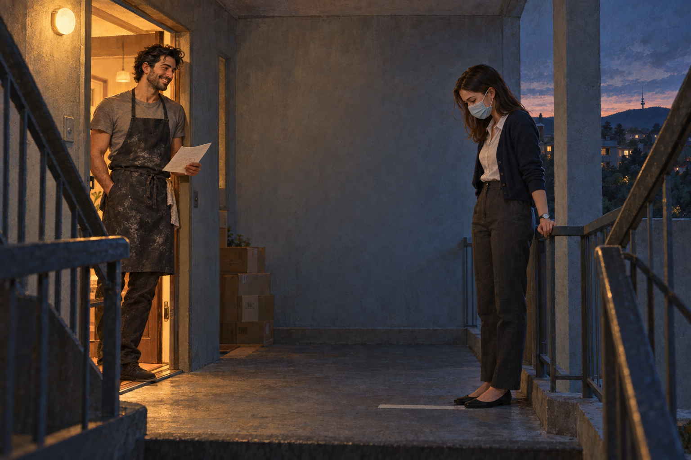

# CLOSE CONTACT

## 1. Where were you when lockdown started?

Elly has a pencil behind her ear, which she thinks makes her look like a journalist. The worksheet lies flat on the kitchen table under the heel of her hand. It is headed *Our Pandemic Stories*, with a cartoon virus in a party hat, which is the kind of decision committees make.

It is my weekend, so it is pancakes. At Dad's it's waffles. Elly will tell you this is a ruling, not a preference.

"Question one," she reads. "Where were you when lockdown started?"

"Level four," I say. "Technically."

"What's technically?"

"It means I'm about to be accurate at you."

She writes *LEVEL 4* in capitals and presses hard enough to dent the table.

&nbsp;

* * *

&nbsp;

On Thursday, 12 August 2021, at five o'clock in the afternoon, the Australian Capital Territory went into lockdown, and Nell Brannigan was already ready.

She had a spreadsheet. She had colour-coded it. Seven days of meals, seven days of walks, seven days of tasks, each in its own cell, each cell in a colour that meant something. She had a plan for the balcony, a plan for the bathroom scales, and a plan for Friday's phone call with her mother, who would read out the New South Wales numbers like an obituary.

Nell was careful. She was careful the way other people were tall. It was simply how she was built.

"Careful" is the word I gave Elly. There is another one.

She lived in flat 4.12 of Telopea House, in Kingston, on the fourth of four floors. One bedroom, one balcony, a view of the lake if you leaned. She worked in risk and assurance for a federal department, which meant she wrote the sentence that began *The likelihood of harm is assessed as*, and then she wrote the rest of it. She was good at it. She had been practising since she was twelve, when her father went to a hardware store for a bag of cement and did not come back out of the car park. A heart nobody had thought to look at. Her mother had spent the next twenty years looking at everything.

The rule that mattered was the third one down. People who lived alone could nominate one other household to visit and to be visited by. One. Nell had nominated Immy, who had been her friend since a first-year seminar on administrative law and who laughed at exactly the moments Nell did not.

It was in the spreadsheet. Cell B14. Green.

Telopea House had been built in 1968 by someone who believed in concrete. Its stairwell was a tall grey throat that carried every sound upward and returned it with interest. In normal times Nell took the lift. From five o'clock that Thursday the lift admitted one person at a time, according to a laminated sign, and the stairs became a kind of public square: people passing with masks and bin bags, nodding like captains of rival ships.

On Friday evening her mother rang and read out the New South Wales numbers in the voice of someone reading the lesson at a funeral. "You'll be careful," said Mo. It wasn't a question.

"I'm always careful," said Nell, and they both heard the sentence for what it was, which was an inheritance.

On Saturday morning her phone lit up on the bench.

*Don't be mad. Marcus asked me to move in and I said yes because I'm a coward and he has a dishwasher. I'm so sorry. I love you. I'll call.*

Nell read it twice, the way she read all bad news: once for the facts, once for the tone. The facts were that Immy no longer lived alone. A household of two cannot be a single's bubble. Cell B14 had stopped being green.

She did not cry. She made a note.

At eleven on Monday, the Chief Minister stood at his lectern and said *the second of September*, and Nell understood that she had been planning for a week and would be living in three. She muted the laptop. Across the landing, through the wall of 4.11, Beryl knocked twice, which meant: *did you see the numbers.* Nell knocked back once. *Yes.*

Then she opened her paper planner. (She kept a paper planner. She did not discuss this.) She ruled a small table with a steel ruler and wrote three headings: *Candidate. Likelihood. Notes.*

*Immy*, she wrote, and put a line through it.

*Colleague, level 2, Barton*: 0.4. He had once described a bushfire as "a bit of weather."

Under the third line she wrote the name from the letterbox of flat 2.07: MARANGOS. She knew him twice. Once on the stairs with six bags of flour, carried two at a time with a delicacy she associated with surgeons. Once from her balcony, when a voice had come up the stairwell at two in the afternoon, singing "Fly Me to the Moon" to nobody, in a tone that had no business being that good.

Beside his name she wrote *Likelihood* and could not think of a number.

She wrote *Unknown*. Then she circled it, which was the opposite of what a risk assessor was supposed to do with unknowns.

She typed the note. Obviously she typed it.

> **Subject: Request to nominate (single's bubble)**
>
> Dear Mr Marangos,
>
> I live in flat 4.12. My original nominee is no longer available. Under the current rules, each of us may nominate one other household. I am writing to propose, for reasons of mutual benefit, that we nominate each other.
>
> Rationale: you appear to be a low-risk individual who lives alone. I saw you carry six bags of flour up the stairs on Thursday. I have no concerns.
>
> I am happy to agree terms in principal. I do not smoke. I wash my hands.
>
> This is not a romantic proposal.
>
> Regards,
> N. Brannigan

She read it aloud to the kitchen. She took out *I wash my hands.* She put it back.

At 8:15 she slid it under the door of flat 2.07. Then she stood in the stairwell for four minutes, with her mask on, listening to her own pulse echo off the concrete, and when she had decided to go upstairs and pretend it had never happened, the door opened.

A double knock came first. Quiet. Two small ones, like a man who didn't want to alarm anyone.

She had not planned for the knock. She turned around.

He was taller than he'd looked from the balcony. He wore an apron over a grey T-shirt, flour on one forearm, and held her note in his left hand. He had marked it in pencil. One word was circled. Up close he smelled of bread and lemon, and she was irritated to find she had noticed.

"I read it twice," he said. "It's the nicest thing anyone's put under my door since the electricity bill."

"Thank you."

"It's *principle*, though." He tapped the circle. "'In principle.' A principal is the head of a school."

"I know what a principal is."

"I'm only saying."

"It was a typo."

"It was a bit of nerves," Theo said, and smiled, and the smile was so unguarded that Nell, who had been trained to see harm in everything, looked at the floor.

Behind him, in the narrow hallway of the flat, four cardboard boxes stood against the wall, taped shut and labelled in a quick, slanting hand. *KITCHEN. KNIVES. BOOKS. MISC.*

He saw her look.

"Spring cleaning," he said.

Nell believed forms. She believed signed statements and time stamps and the words of people who were being polite. She nodded.

"So the answer is?" she said.

"Yes," said Theo. "Obviously. Yes."

She climbed with her mask on and her heart doing something she would have flagged in a report. On the third landing, behind her, from two floors down, it began: a man's voice, rising up the grey throat of the stairwell, singing. Not to nobody this time. She was nearly sure.

At the top she stopped with her hand on the door of 4.12 and realised she hadn't looked at her watch. Not once. Not on the stairs, not at the door, not through the whole of it.

It was the first thing all week she hadn't timed.
