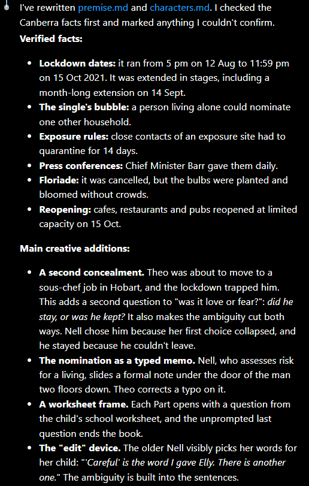
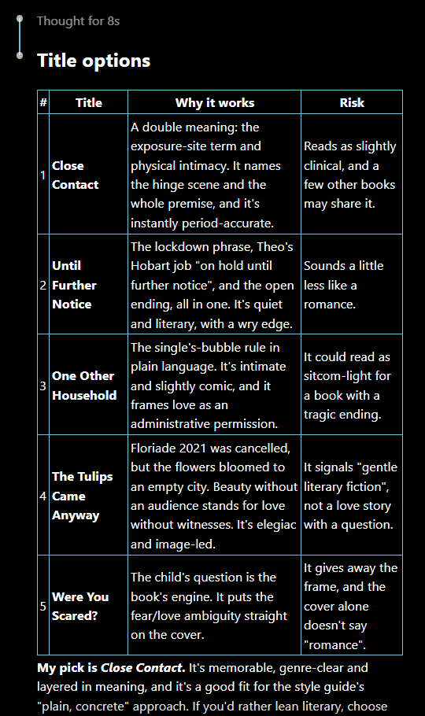
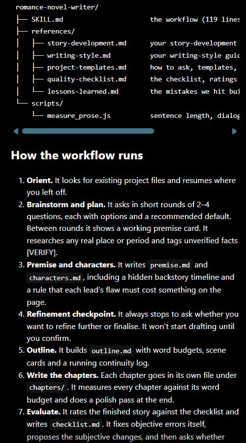

# Prompt Log: *Close Contact*

The prompts used, in order, to analyse a sample novel, build a romance from scratch, write and review it, and turn the workflow into a reusable skill. Each prompt is shown in a table, followed by any screenshots of Claude's output.

---

## Prompt 1: Analyse the sample novel

| Prompt |
|---|
| Analyse the sample novel at `@"sample text/the-notebook.pdf"`.  Create two files:  **1. `writing-style.md`** Capture the novel’s writing style comprehensively so it can later be used as the foundation for a reusable novel-writing skill.  Include exemplars from the sample text to make the guidance actionable.  The resulting skill should describe transferable writing principles, not depend on this particular novel, its characters, setting, or plot.  **2. `story-development.md`** Capture the storytelling techniques behind how the novel develops a compelling story, so this can later become a reusable story-development skill.  Cover: • **Premise & concept** — coming up with an interesting core idea • **Plotting** — deciding what happens, in what order, and why • **Character arcs** — how characters change through the story • **Conflict & stakes** — what characters want, what stops them, and why it matters • **Story structure** — setup, escalation, turning points, climax, resolution • **World-building** — creating the setting, rules, history, and context • **Scene design** — deciding what each scene needs to accomplish • **Originality & imagination** — finding unexpected but believable developments  Include exemplars from the sample novel where useful, but extract the underlying principles so the final file is reusable across different novels.  **Goal** Both files should be practical, structured, and detailed enough to serve as core skills for future novel writing, while remaining generalisable beyond the sample text. |

---

## Prompt 2: Brainstorm and refine the premise

| Prompt |
|---|
| Let's brainstorm and refine the premise together.  I want a romantic story with some tragedy — not a completely happy ending, but one that feels meaningful and leaves the reader with something to think about.  The story should centre on a young couple in Canberra during COVID.  Use `@story-development.md` to guide the brainstorming and help refine the premise into something compelling, emotionally strong, and believable. |

**Output screenshots**

| Question 1: premise direction | Question 2: type of ending | Question 3: frame story |
|:---:|:---:|:---:|
|  |  |  |

---

## Prompt 3: Save the premise and develop the characters

| Prompt |
|---|
| Save the refined premise as `premise.md`.  Then develop the main characters based on that premise and save them in `characters.md`. |

---

## Prompt 4: Refine the premise and characters

| Prompt |
|---|
| Refine `@premise.md` and `@characters.md`.  Fill in the missing details, strengthen the ideas, and be creative while keeping everything coherent and believable. |

**Output screenshot**

---

## Prompt 5: Title options and chapter structure

| Prompt |
|---|
| Give me 5 title options for the novel.  Also recommend the number of chapters and an approximate length for each chapter. |

**Output screenshot**

---

## Prompt 6: Set the title and form

| Prompt |
|---|
| Set the title to **Close Contact** and structure it as a short story with **5 chapters**.  Update the relevant documents accordingly. |

---

## Prompt 7: Write the story

| Prompt |
|---|
| Now start writing the story.  Write each chapter in a separate `.md` file, following the established premise, characters, and story-development guidance. |

---

## Prompt 8: Final polish pass

| Prompt |
|---|
| Do a final polish pass against `writing-style.md`. |

---

## Prompt 9: Quality checklist and review

| Prompt |
|---|
| Create a quality checklist for evaluating the novel.  Use it to review the completed story, assess its strengths and weaknesses, and document the results in `checklist.md`. |

---

## Prompt 10: Create the romance-novel skill

| Prompt |
|---|
| Create a Claude skill for writing romantic novels.  The skill should combine: • the writing style from `writing-style.md` • the story-development approach from `story-development.md`  Workflow: 1. Help brainstorm and plan the story. 2. Develop the premise and characters. 3. Ask whether I want to refine them further. 4. Once they are finalised, write the chapters accordingly. 5. After the story is complete, evaluate it using the checklist we established.  Create the skill file so it can be reused for future romantic novel projects. |

**Output screenshot**

---

## Prompt 11: Image-generation prompts

| Prompt |
|---|
| Create `image-generation-prompts.md` with two sections:  **Section 1 — Character descriptions** For each character in `characters.md`, write a consistent visual description to be reused across all image-generation prompts.  **Section 2 — Chapter image prompts** For each chapter, create one AI image-generation prompt for an illustrative image to appear at the beginning of the chapter.  If a character appears in the image, include their full description from Section 1 **exactly as written**.  Each prompt must work independently, while maintaining character consistency across all generated images. |
